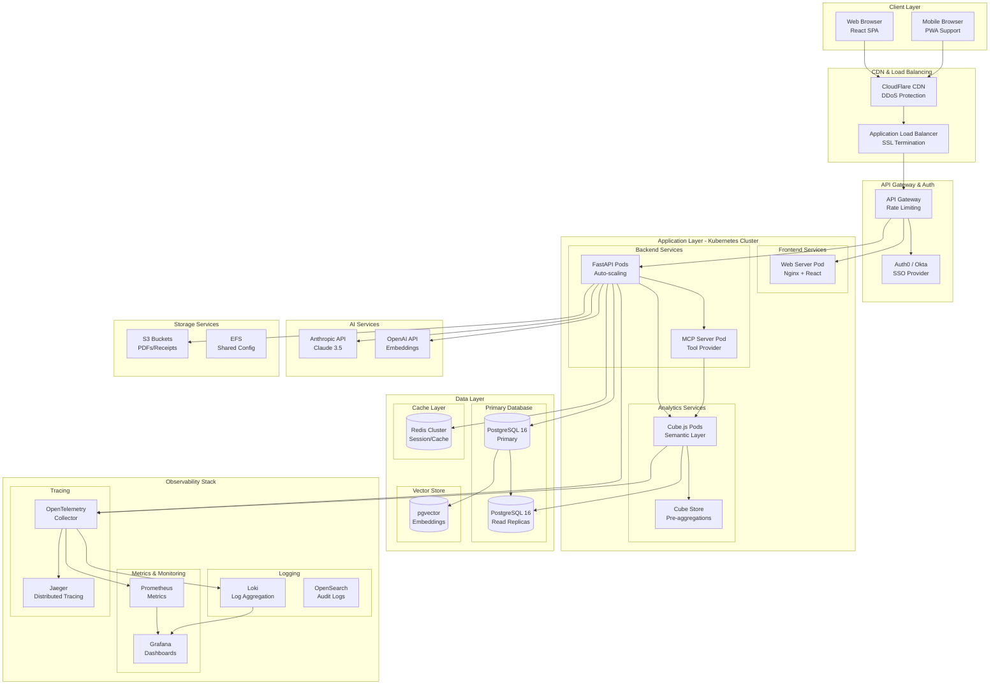
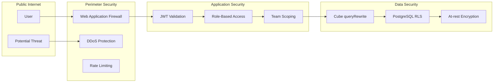
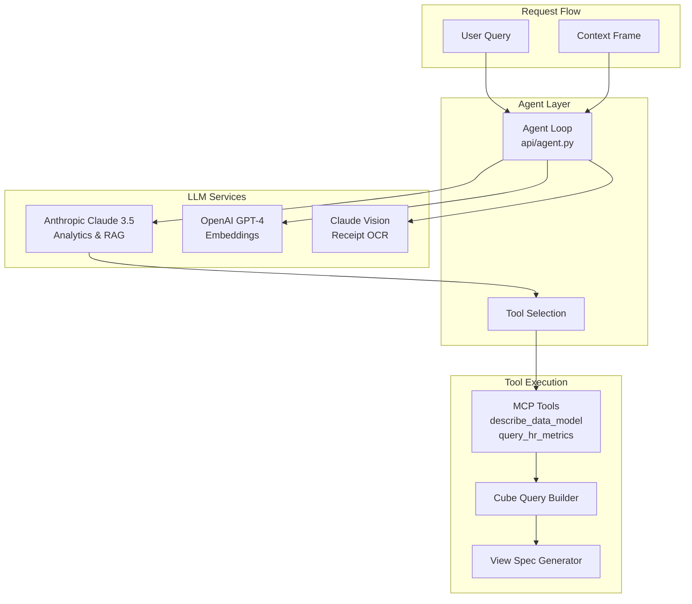
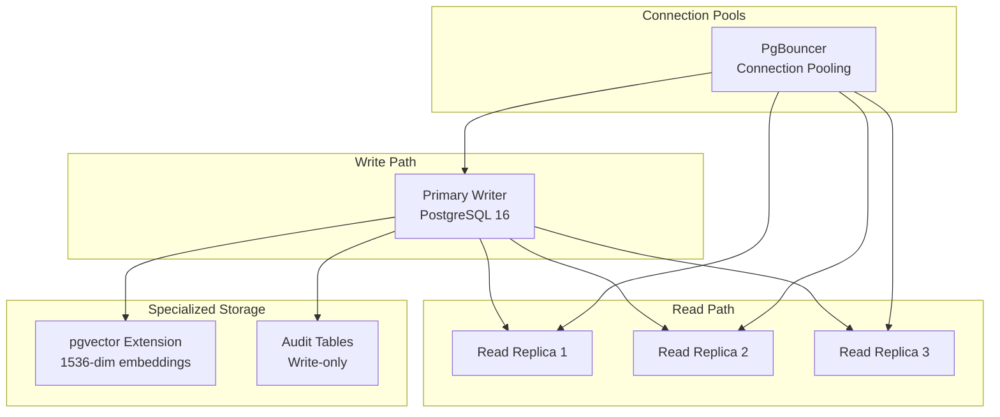
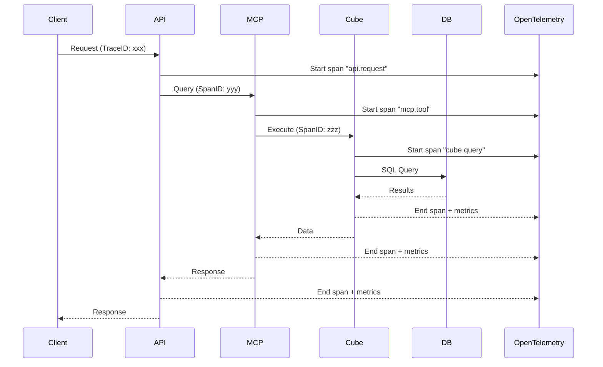

# High-Level Cloud Architecture

## System Overview

The HR Analytics Platform is a cloud-native, microservices-based application designed for scalability, security, and observability. The architecture leverages containerized services, semantic data layers, and AI capabilities while maintaining strict security boundaries.

## Architecture Diagram



## Container Architecture

### Production Containers

```yaml
# Kubernetes Deployment Structure
namespaces:
  - hr-platform-prod
  - hr-platform-staging
  - hr-platform-monitoring

deployments:
  frontend:
    image: hr-platform/web:latest
    replicas: 3
    resources:
      requests: { cpu: 100m, memory: 128Mi }
      limits: { cpu: 500m, memory: 512Mi }
    
  api:
    image: hr-platform/api:latest
    replicas: 5
    autoscaling:
      min: 3
      max: 20
      targetCPU: 70%
    resources:
      requests: { cpu: 500m, memory: 512Mi }
      limits: { cpu: 2000m, memory: 2Gi }
    
  cube:
    image: cubejs/cube:latest
    replicas: 3
    resources:
      requests: { cpu: 1000m, memory: 2Gi }
      limits: { cpu: 4000m, memory: 8Gi }
    
  mcp-server:
    image: hr-platform/mcp:latest
    replicas: 2
    resources:
      requests: { cpu: 250m, memory: 256Mi }
      limits: { cpu: 1000m, memory: 1Gi }
```

## Security Architecture

### Network Security Layers



### Security Components

1. **Perimeter Security**
   - CloudFlare WAF & DDoS protection
   - API Gateway rate limiting (100 req/min per user)
   - IP allowlisting for admin endpoints

2. **Authentication & Authorization**
   - Auth0/Okta SSO integration
   - JWT tokens with 15-minute expiry
   - Refresh token rotation

3. **Application Security**
   - Team-scoped Cube JWT generation
   - No raw SQL execution paths
   - Parameterized queries only

4. **Data Security**
   - PostgreSQL Row-Level Security (RLS)
   - Cube semantic layer filtering
   - Sensitive field exclusion at model level

5. **Secrets Management**
   - AWS Secrets Manager / HashiCorp Vault
   - Automatic key rotation
   - Environment-specific secrets

## LLM Integration Architecture



### LLM Security Boundaries

- **No SQL Generation**: LLM outputs Cube query objects only
- **No Direct DB Access**: All queries go through Cube semantic layer
- **Scoped Context**: Team scope injected server-side, not from LLM
- **View-Only Specs**: LLM returns JSON specs, not executable code

## Database Architecture

### PostgreSQL Cluster Configuration



### Data Partitioning Strategy

- **Absences**: Partitioned by year
- **Audit_log**: Partitioned by month
- **Policy_chunks**: Indexed with HNSW for vector search
- **Employment_events**: Partitioned by event_date

## Observability Stack

### Metrics Collection

```yaml
metrics:
  application:
    - request_duration_seconds
    - active_connections
    - error_rate
    - llm_token_usage
    
  business:
    - queries_per_manager
    - avg_response_time
    - chat_sessions_count
    - document_upload_rate
    
  infrastructure:
    - cpu_utilization
    - memory_usage
    - disk_io
    - network_throughput
```

### Distributed Tracing Flow



### Logging Architecture

```yaml
log_pipeline:
  sources:
    - application_logs: stdout/stderr
    - access_logs: nginx
    - audit_logs: postgresql
    
  processors:
    - timestamp_parser
    - json_parser
    - team_enricher
    - pii_redactor
    
  destinations:
    - loki: general_logs
    - elasticsearch: audit_compliance
    - s3: long_term_archive
```

## Scalability Considerations

### Horizontal Scaling Points

1. **API Pods**: Auto-scale based on CPU/memory
2. **Cube Workers**: Scale based on query queue depth
3. **Database Replicas**: Add readers for analytics workload
4. **Redis Nodes**: Scale for session management

### Performance Optimizations

1. **Cube Pre-aggregations**: Daily/weekly rollups
2. **Database Indexes**: Covering indexes for common queries
3. **CDN Caching**: Static assets + API responses
4. **Connection Pooling**: PgBouncer for database connections

## Disaster Recovery

### Backup Strategy

```yaml
backups:
  database:
    frequency: hourly
    retention: 30 days
    location: cross-region S3
    
  documents:
    frequency: real-time
    retention: indefinite
    location: S3 with versioning
    
  configurations:
    frequency: on-change
    retention: 90 days
    location: git + S3
```

### RTO/RPO Targets

- **RTO** (Recovery Time Objective): 1 hour
- **RPO** (Recovery Point Objective): 5 minutes
- **Failover**: Automated with health checks
- **Rollback**: Blue-green deployments

## Cost Optimization

### Resource Allocation

```yaml
environments:
  production:
    compute: Reserved Instances (70% discount)
    database: Aurora Serverless v2
    storage: S3 Intelligent Tiering
    
  staging:
    compute: Spot Instances (90% discount)
    database: Smaller RDS instance
    storage: S3 Standard
    
  development:
    compute: On-demand (scaled down)
    database: Local Docker
    storage: Local filesystem
```

### Monitoring Costs

- Tag all resources by team/service
- Set budget alerts at 80% threshold
- Review unused resources weekly
- Implement auto-shutdown for non-prod